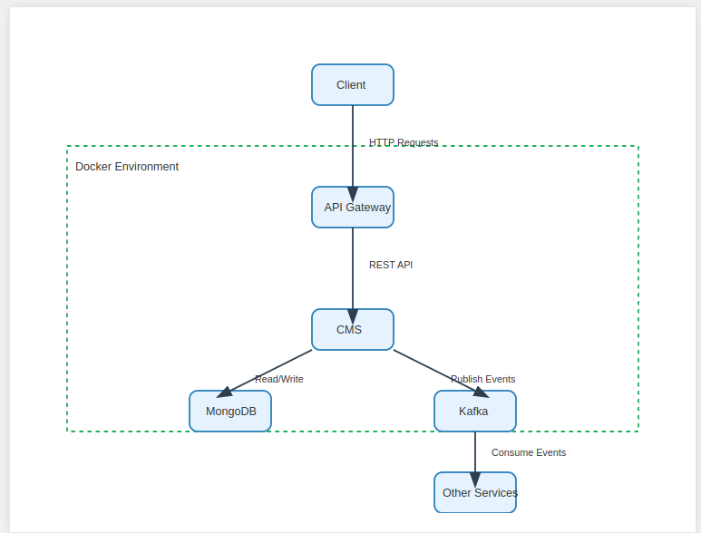

# Customer Management System

This project is a Spring Boot application that manages customer data using MongoDB for storage and Kafka for event streaming.

## Prerequisites

- Java 17
- Gradle
- Docker and Docker Compose

## Project Structure

The project follows a standard Spring Boot application structure:

```
customer-management-system/
│
├── src/main/java/com/example/cms/
│   ├── config/
│   ├── controller/
│   ├── model/
│   ├── repository/
│   ├── service/
│   └── CustomerManagementSystemApplication.java
│
├── src/main/resources/
│   └── application.yml
│
├── build.gradle
├── settings.gradle
├── Dockerfile
├── docker-compose.yml
└── README.md
```

## Building the Application

HLD for the application


### Using Docker Compose

To run the entire stack (application, MongoDB, and Kafka) using Docker Compose:

```
docker compose build
docker compose up -d
```

To stop the services:

```
docker compose down
```

## API Documentation

Once the application is running, you can access the Swagger UI at:

```
http://localhost:8080/swagger-ui.html
```

This provides an interactive interface to explore and test the API endpoints.

## Main Features

1. Create new customers and publish the Customer Data to Kafka to let other services in ecosystem know about it.
2. Retrieve customers based on name, city, or state
3. Compare customer lists (only in A, only in B, in both A and B)

## Technology Stack

- Spring Boot
- MongoDB
- Apache Kafka
- Swagger (OpenAPI)
- Docker

## Notes

- The application uses MongoDB for data persistence. Ensure MongoDB is running and accessible.
- Kafka is used for event streaming. The application will create a topic named "customer-created" on startup.
- The application is containerized using Docker, making it easy to deploy and run in various environments.

For any issues or questions, please open an issue in the project repository.

